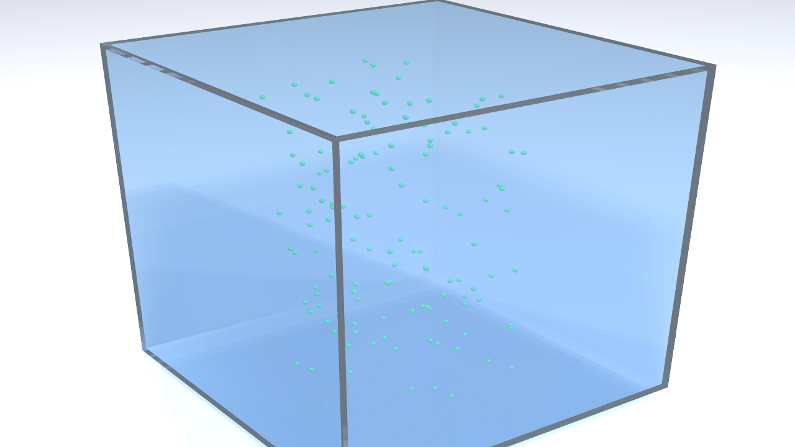

# navier-stokes-vortex-lab

A reproducible POV-Ray + Python visualization project for a **finite-scale laboratory analogue** of a contracting, stretching, swirling Navier–Stokes flow with localized oscillatory perturbations.

This repository is intended to separate:

1. **trajectory generation / kinematics** — Python + NumPy,
2. **3D rendering** — POV-Ray,
3. **movie assembly** — ffmpeg.

It is deliberately **not** a claim to numerically solve, reproduce, or physically realize a mathematical Navier–Stokes singularity. The initial model is a controlled, finite-scale, kinematic analogue designed for visualization and later experimental design work.

## Two parallel project tracks

This repository now has two related but distinct tracks:

1. **Visualization** — the existing Python/POV-Ray/ffmpeg pipeline for making the
   proposed flow and apparatus understandable in three dimensions.
2. **Physical realizability / boundary control** — a research program asking
   whether physically realizable external actuators and sensors can reproduce
   experimentally meaningful portions of the desired interior dynamics.

The second track must not rely on arbitrary volumetric forcing as the final
experimental mechanism. See [PROJECT_TRACKS.md](PROJECT_TRACKS.md),
[PHYSICAL_REALIZABILITY_PLAN.md](PHYSICAL_REALIZABILITY_PLAN.md), and
[CONTROL_RESEARCH_ROADMAP.md](CONTROL_RESEARCH_ROADMAP.md).



This representative frame uses the current tracer-only view: pressure sensors
and actuator hardware are hidden, and tracer markers are enlarged relative to
the physical particles for visibility.

## Repository layout

```text
navier-stokes-vortex-lab/
├── README.md
├── AGENTS.md
├── .gitignore
├── requirements.txt
├── make_trajectories.py
├── fluid.pov
├── materials.inc
├── tank.inc
├── tracer.inc
├── actuators.inc
├── render.sh
├── render.ps1
├── make_movie.sh
├── make_movie.ps1
├── positions/
│   └── .gitkeep
├── frames/
│   └── .gitkeep
└── movie/
    └── .gitkeep
```

## Recommended environment

Primary development environment:

- Windows 11
- WSL2 Ubuntu
- VS Code with Remote - WSL
- Python 3 + NumPy
- POV-Ray
- ffmpeg
- Git
- Codex CLI, if desired

The repository itself should normally live in the WSL Linux filesystem, for example:

```bash
~/src/navier-stokes-vortex-lab
```

rather than under `/mnt/c/...`.

## Quick start

### 1. Create a virtual environment

```bash
python3 -m venv .venv
source .venv/bin/activate
pip install -r requirements.txt
```

### 2. Generate tracer trajectories

```bash
python make_trajectories.py
```

This writes one POV-Ray include file per animation frame into `positions/`.

Each file defines:

```pov
#declare SimTime = ...;
#declare TauRatio = ...;
#declare CoreRadius = ...;
#declare CoreHalfHeight = ...;
#declare ActuatorPhase = ...;
#declare NBeads = ...;
#declare BeadPos = array[NBeads] { ... };
```

### 3. Render the POV-Ray frames

On WSL/Linux:

```bash
./render.sh
```

On PowerShell:

```powershell
.\render.ps1
```

The scripts render PNG files into `frames/`.

### 4. Build the MP4

On WSL/Linux:

```bash
./make_movie.sh
```

On PowerShell:

```powershell
.\make_movie.ps1
```

The final movie will be written to:

```text
movie/navier-stokes-vortex-lab.mp4
```

## Test with a short render first

Before rendering all frames, edit `render.sh` or run POV-Ray directly for a small frame range.

For example:

```bash
povray fluid.pov \
  +W1280 +H720 \
  +KFI1 +KFF20 \
  +KI0 +KF1 \
  +FN +A0.2 -J \
  +Oframes/frame
```

Then inspect several frames before committing to a long high-resolution render.

## Tracer visibility

The default view hides the illustrative PIV sheet, core cylinder, and actuator
hardware so that
tracer motion is easier to see. Add `Declare=ShowPIVSheet=1` and/or
`Declare=ShowCore=1` to a POV-Ray command to display these optional overlays.
Use `Declare=ShowActuators=1` to show the diaphragm housings and their supports.
Blue sensor markers are hidden by default; `Declare=ShowSensors=1` displays them.
Neither the actuators nor sensors participate in the prescribed velocity field.
The tracer marker radius is exaggerated to 0.014 model units for visibility;
it does not represent the experimental particle size or affect trajectories.
The experimental concept uses 10–20 µm diameter PIV particles (see
[EXPERIMENT.md](EXPERIMENT.md)).
The markers use a bright green-cyan fluorescent appearance with low gloss and
no mirror reflection or cast shadows. Their emission is an illustrative
visibility aid across the volume, not a model of wavelength-dependent
fluorescence or laser-sheet excitation.

The current four-second visibility test uses 128 tracers, twice the preceding
64-particle preview, and the first 120 frames of a 450-frame trajectory at 30 fps.
Generate that trajectory with
`python3 make_trajectories.py --frames 450 --fps 30 --beads 128`.
Render frames 1–120 with `+KFI1 +KFF450 +SF1 +EF120` to retain the same flow
timing as the earlier clip. The generator's general default remains 500 tracers.

The red actuator markers and arrows described in the experimental concept are
now represented by gray cylindrical housings with dark, bulging diaphragm
faces. Three support rings and four floor-mounted posts show how this
illustrative hardware could be held in place. Sensors sit between the housings.
Diaphragm motion follows an oscillating `m=4` command with exaggerated travel;
the prescribed tracer velocity field is not computed from this hardware motion.
These shapes are a visualization concept, not a mechanical or fluid-structure design.

## Render speed experiments

Both render scripts default to `+A0.2 -J -V`. `-V` suppresses POV-Ray's
per-pixel progress output while retaining render statistics and errors. Area-light jitter is also disabled in
`fluid.pov`. Disabling both kinds of jitter follows
[POV-Ray's animation guidance](https://www.povray.org/documentation/view/3.7.0/112/)
and avoids random sampling noise between frames.

Set `AA_THRESHOLD` to compare anti-aliasing thresholds, keeping the frame range,
resolution, particle data, and scene switches fixed:

```bash
AA_THRESHOLD=0.4 NFRAMES=10 ./render.sh
```

```powershell
$env:AA_THRESHOLD = "0.4"
$env:NFRAMES = "10"
.\render.ps1
```

Try `0.2`, `0.3`, or `0.4`. A higher threshold applies extra samples to fewer
pixels, which can save time but leave rougher edges or lose small particle
detail. `-J` controls pixel-sampling jitter; it does not control area-light jitter.
The [POV-Ray tracing reference](https://www.povray.org/documentation/3.7.0/r3_2.html#r3_2_8_7)
describes these options. Render into separate output directories when comparing
settings; the scripts overwrite matching frame filenames.

## How the tracer motion works

The Python program treats each bead as a passive tracer satisfying

\[
\frac{d\mathbf{x}}{dt}=\mathbf{u}(\mathbf{x},t).
\]

It integrates trajectories using classical fourth-order Runge-Kutta (RK4).

The initial illustrative velocity field contains:

- inward radial contraction,
- axial stretching,
- swirl,
- an annular, oscillatory \(m=4\) perturbation.

The linear mean core flow is chosen in cylindrical coordinates as

\[
u_r=-a(t)r,\qquad
u_z=2a(t)z,
\]

which is divergence-free before the wall-tapering and perturbation terms are applied:

\[
\frac1r\frac{\partial(ru_r)}{\partial r}
+
\frac{\partial u_z}{\partial z}=0.
\]

The current full field should therefore be regarded as a **kinematic visualization model**, not an exact incompressible Navier–Stokes solution. One of the natural next steps is to replace the ad hoc wall taper and perturbation with a more rigorously divergence-free construction.

## POV-Ray animation model

POV-Ray renders one frame at a time. `fluid.pov` maps its built-in `frame_number` to an include file such as:

```text
positions/frame0001.inc
positions/frame0002.inc
...
```

The particle trajectories therefore do **not** need to be numerically integrated inside POV-Ray. Python performs the numerical work once; POV-Ray is used as a deterministic renderer.

## Why POV-Ray

POV-Ray is a good fit for this project because the scene is primarily:

- mathematical,
- procedural,
- made from repeated primitives,
- reproducible from text source,
- naturally animated using frame/clock variables,
- easy to render headlessly and combine with ffmpeg.

This project was intentionally modeled after the workflow used in the older `rharriszzz/beads` POV-Ray project.

## POV-Ray build notes for WSL2

If building POV-Ray from source, a typical Ubuntu setup requires development packages for Boost and image libraries.

If `configure` reports:

```text
configure: error: Could not link against boost_thread !
```

install the component libraries explicitly:

```bash
sudo apt install libboost-thread-dev libboost-system-dev
```

and, if necessary, rerun configure with:

```bash
./configure \
  COMPILED_BY="Richard Harris" \
  --with-boost-libdir=/usr/lib/x86_64-linux-gnu \
  LIBS="-lboost_system -lboost_thread"
```

If that still fails, inspect the actual linker error in `config.log` rather than relying on the final `configure` summary.

## Generated files and Git

Generated trajectory files, rendered frames, and movies are intentionally ignored by Git. Keep only source and small configuration files under version control.

The `.gitkeep` files preserve the empty output directories in a fresh clone.

## Suggested development sequence

1. Confirm `make_trajectories.py` runs.
2. Render one static frame.
3. Render 10–20 frames and verify visible particle motion.
4. Render the full low-resolution movie.
5. Improve scene geometry and materials.
6. Improve the velocity field.
7. Add diagnostics and validation.
8. Increase resolution only after the animation is correct.

## Scientific caution

Keep a clear distinction between:

- mathematical similarity laws,
- the simplified velocity field used here,
- a CFD solution,
- and an eventual physical experiment.

The renderer should help us reason about the apparatus and tracer motion without implying a level of physical fidelity that the current model does not have.
